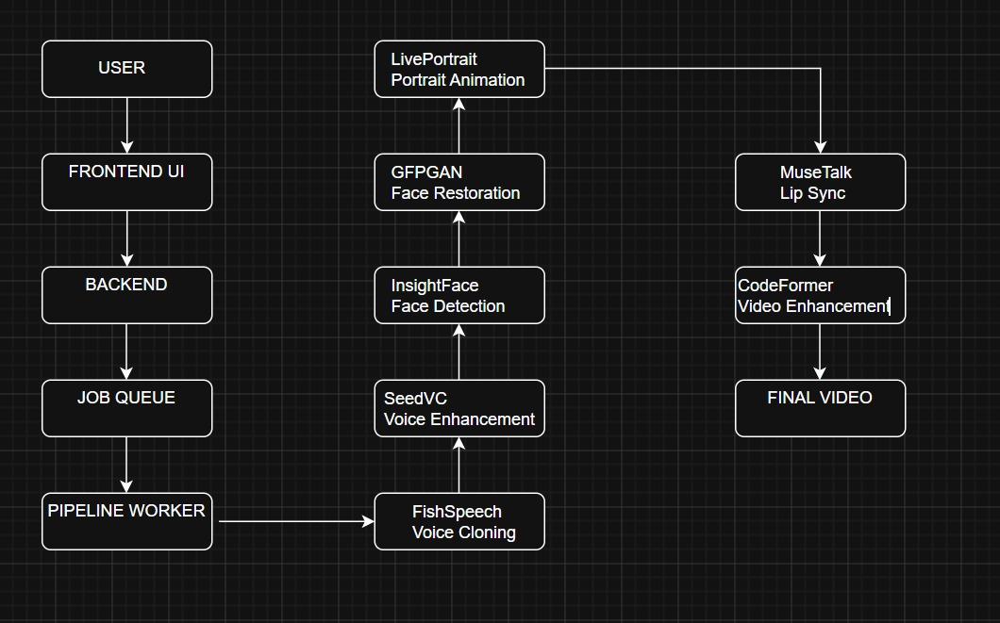

# 🎭 Conversely AI
## Production-Scale AI Avatar Generation Pipeline

Conversely AI is an end-to-end AI Avatar Generation System capable of transforming a single face image, voice sample, and text script into a realistic talking avatar video.

The platform combines multiple state-of-the-art AI models into a unified production pipeline for voice cloning, voice enhancement, portrait animation, lip synchronization, face restoration, and video enhancement.

Unlike standalone AI demos, this project focuses on orchestration, automation, and deployment of multiple specialized models into a complete avatar generation workflow.

---

# 🚀 Project Overview

Generating high-quality AI avatars requires multiple independent AI systems working together.

Conversely AI automates the entire process:

### Input

- Face Image
- Voice Sample
- Script

### Output

- Lip-Synced Talking Avatar Video

The user only uploads three assets while the platform handles the entire AI pipeline automatically.

---

# 🏗️ System Architecture



The system consists of:

### Frontend

Responsible for:

- Asset Upload
- User Interaction
- Generation Progress Tracking
- Video Preview

Technologies:

- HTML
- CSS
- JavaScript

---

### Backend

Responsible for:

- API Endpoints
- Job Creation
- Job Monitoring
- File Management

Technology:

- FastAPI

---

### Pipeline Worker

Responsible for:

- Job Detection
- AI Model Orchestration
- Status Tracking
- Final Video Generation

Technology:

- Python

---

# ⚙️ Complete Pipeline Flow

## Step 1 — User Upload

The user uploads:

- Image
- Voice Sample
- Script

The backend creates a unique job directory:

```text
avatar_pipeline/
└── job_xxxxx/
```

and stores:

```text
image.jpg
voice_sample.wav
script.txt
status.txt
```

---

## Step 2 — Voice Cloning

### Model

FishSpeech

### Purpose

Generate synthetic speech that matches the speaker's voice.

### Input

```text
voice_sample.wav
script.txt
```

### Output

```text
generated_voice.wav
```

---

## Step 3 — Voice Enhancement

### Model

SeedVC

### Purpose

Improve realism and speaker similarity.

### Input

```text
generated_voice.wav
voice_sample.wav
```

### Output

```text
enhanced_voice.wav
```

---

## Step 4 — Face Detection & Alignment

### Model

InsightFace

### Purpose

Detect and align the face for animation.

### Output

```text
aligned_face.jpg
```

---

## Step 5 — Face Restoration

### Models

- GFPGAN
- RealESRGAN

### Purpose

Improve image quality and facial details.

### Output

```text
enhanced_face.jpg
```

---

## Step 6 — Portrait Animation

### Model

LivePortrait

### Purpose

Animate a static portrait using a driving video.

### Output

```text
liveportrait.mp4
```

---

## Step 7 — Lip Synchronization

### Model

MuseTalk

### Purpose

Synchronize lip movement with generated speech.

### Inputs

```text
liveportrait.mp4
enhanced_voice.wav
```

### Output

```text
raw_musetalk.mp4
```

---

## Step 8 — Video Enhancement

### Model

CodeFormer

### Purpose

Restore facial details and improve video quality.

### Output

```text
final.mp4
```

---

# 📂 Project Structure

```text
AI_AVATARS/

├── backend/
│
│   ├── main.py
│   └── .env.example
│
├── frontend/
│
│   ├── index.html
│   ├── style.css
│   └── script.js
│
├── pipeline/
│
│   └── main_pipeline.py
│
├── setup/
│
│   ├── setup_fishspeech.py
│   ├── setup_seedvc.py
│   ├── setup_liveportrait.py
│   ├── setup_gfpgan.py
│   ├── setup_codeformer.py
│   └── setup_musetalk/
│
├── services/
│
├── docs/
│
├── examples/
│
├── assets/
│
├── requirements.txt
│
├── LICENSE
│
└── README.md
```

---

# 🧠 AI Models Used

| Component | Model |
|------------|---------|
| Voice Cloning | FishSpeech |
| Voice Enhancement | SeedVC |
| Face Detection | InsightFace |
| Face Restoration | GFPGAN |
| Upscaling | RealESRGAN |
| Portrait Animation | LivePortrait |
| Lip Sync | MuseTalk |
| Video Enhancement | CodeFormer |

---

# 🌐 API Endpoints

## Generate Avatar

```http
POST /generate-avatar
```

### Request

```multipart/form-data
image
voice
text
```

### Response

```json
{
  "job_id": "12345",
  "status": "pending"
}
```

---

## Check Status

```http
GET /job-status/{job_id}
```

### Response

```json
{
  "job_id": "12345",
  "status": "completed",
  "video_url": "..."
}
```

---

# 📸 Screenshots

## Frontend


---

## Architecture


---

## Generated Avatar


---

# 🛠️ Installation

## Clone Repository

```bash
git clone https://github.com/namanjainb3-tech/AI_AVATARS.git

cd AI_AVATARS
```

---

## Backend Setup

```bash
cd backend

pip install -r requirements.txt

uvicorn main:app --reload
```

---

## Setup AI Services

```bash
python setup/setup_fishspeech.py

python setup/setup_seedvc.py

python setup/setup_liveportrait.py

python setup/setup_gfpgan.py

python setup/setup_codeformer.py
```

### MuseTalk

```bash
python setup/setup_musetalk/setup_musetalk_install.py

python setup/setup_musetalk/setup_musetalk_models.py

python setup/setup_musetalk/setup_musetalk_patch.py
```

---

## Start Pipeline Worker

```bash
python pipeline/main_pipeline.py
```

---

# 🎯 Key Engineering Challenges Solved

- Multi-model orchestration
- Cross-model compatibility
- Automated job processing
- Face preprocessing pipeline
- Voice enhancement workflow
- AI service communication
- RunPod deployment
- GPU inference management
- Long-running background tasks
- Automated status tracking

---

# 📈 Future Improvements

- Emotion control
- Custom driving videos
- Multi-language support
- Streaming generation
- Better lip synchronization
- Full cloud deployment
- Avatar fine-tuning

---

# 👨‍💻 Author

## Naman Jain

Computer Science Engineering  
IIIT Sonepat

AI Engineer | Full Stack Developer

---

# 🙏 Acknowledgements

This project integrates several outstanding open-source projects:

- FishSpeech
- SeedVC
- LivePortrait
- MuseTalk
- GFPGAN
- RealESRGAN
- InsightFace
- CodeFormer

All rights for the underlying models belong to their respective authors and organizations.

This repository focuses on system integration, orchestration, deployment, and engineering of a complete AI Avatar Generation Pipeline.
